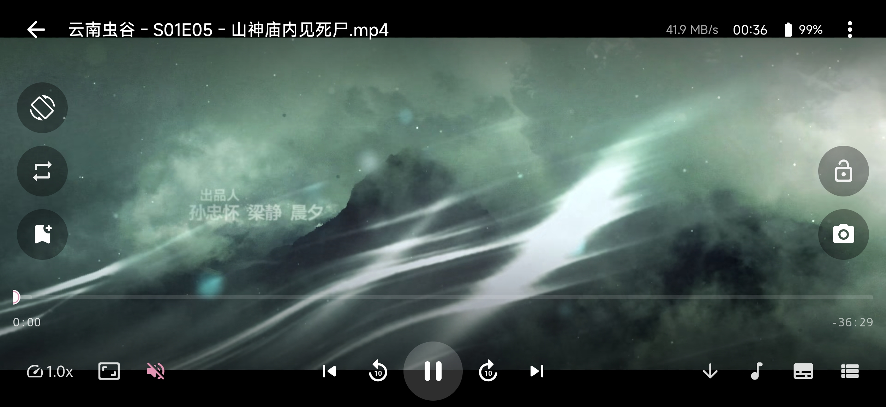
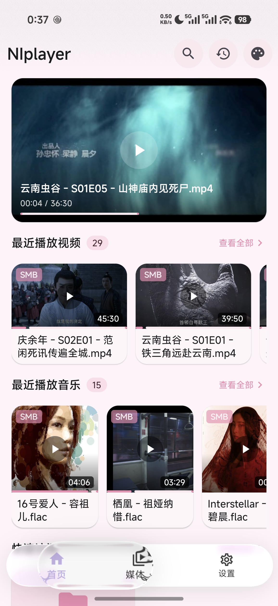
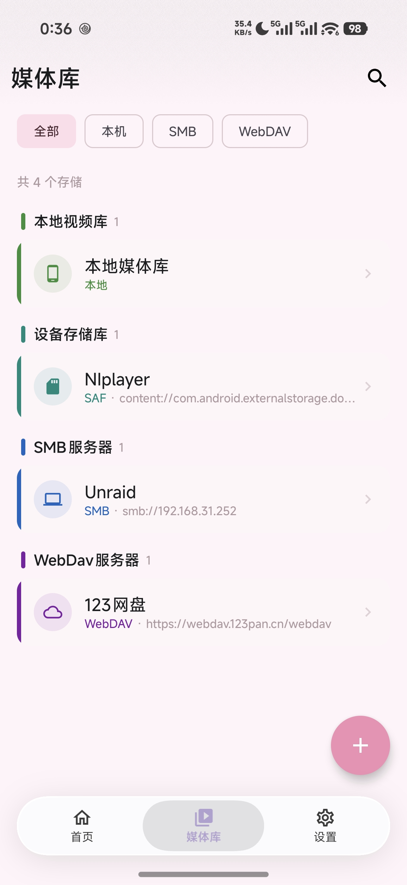
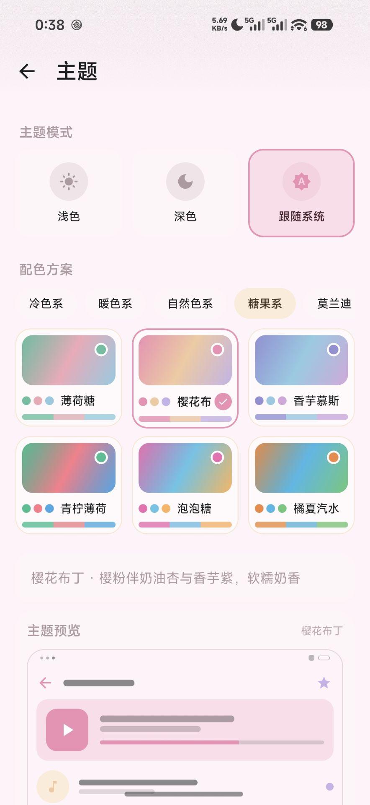
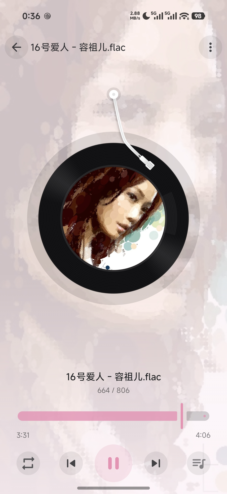
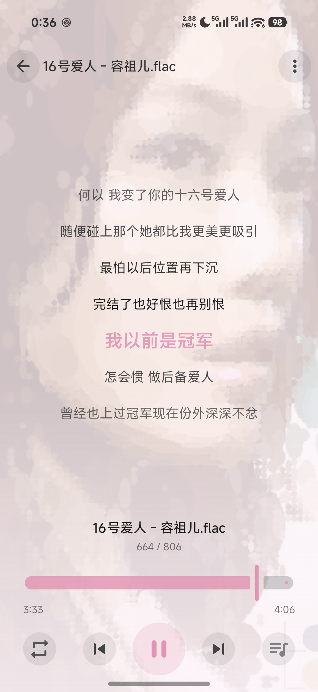
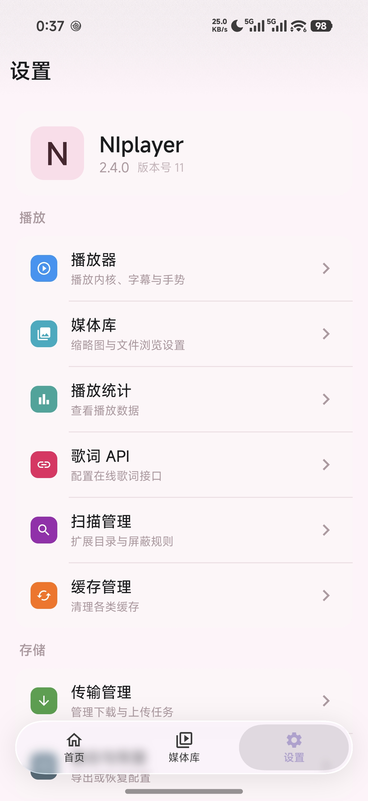

# 🎬 NIplayer v2


> **一站式媒体播放体验** —— 统一访问本地 / SAF / SMB / WebDAV 四类存储，轻松播放视频、音频与图片，内置专业级播放控制、ASS 特效字幕引擎与 WebDAV 云同步，支持多语言与应用内在线更新。完全重构自 [NIplayer v1.x](https://github.com/nichx/NIplayer)。

---

## ✨ 亮点速览

| 领域 | 核心能力 |
|------|----------|
| 🎬 **视频播放** | 手势控制 · 倍速不变调 · A-B 循环 · 黑边检测 · 画中画 · 连播 |
| 🎵 **音频播放** | 黑胶转盘 · LRC 歌词 · 均衡器 · 沉浸式横屏 · 通知栏后台播放 |
| 📝 **字幕系统** | ASS/SSA 特效自研引擎 · 样式自定义 · Assrt 在线搜索 |
| 💾 **多源存储** | 本地 / SAF / SMB / WebDAV 统一浏览与播放 · 远程文件管理 |
| 🔒 **文件夹加密** | 目录密码门禁 · 离开自动上锁 · 加密内容不记历史 |
| 🔄 **云同步** | WebDAV 播放历史同步 · 冲突处理 · 备份一键导入导出 |
| ⬇️ **下载与更新** | 断点续传 · 批量下载 · 应用内在线更新 |
| 🔍 **全局搜索** | 跨媒体库标题搜索，一键播放 / 定位 |
| 🌍 **多语言** | 内置简体中文 / English，应用内一键切换 |
| 🎨 **个性化** | 动态取色主题 · 播放统计 · 视频书签 · 快捷访问 |
| 🧊 **液态玻璃 UI** | 真实背景模糊 · 悬浮玻璃导航/弹窗/底栏 · 通透度可调 |

---

## 📸 界面预览

**视频播放器 · 横屏沉浸回放**



| 首页 | 媒体库 | 主题设置 |
|:---:|:---:|:---:|
|  |  |  |

| 黑胶唱片 · 音频 | LRC 歌词 | 设置 |
|:---:|:---:|:---:|
|  |  |  |

> ⚠️ **版权免责声明**：截图中出现的影视、音乐及封面内容（如《庆余年》《云南虫谷》及音乐 FLAC）均来自用户自有媒体库（SMB / WebDAV），仅用于展示本应用的功能与界面效果。所有影视作品、音乐、专辑封面之版权归各自版权方所有，请确保你拥有相应的播放与个人使用权限。

---

## 📺 视频播放

**专业级手势控制**

- **手势操控**：左半屏上下滑调亮度、右半屏上下滑调音量、横向滑动精确定位进度；单击显示/隐藏控制栏，双击快进/快退 10 秒
- **倍速播放**：多档倍速 + 长按临时倍速并拖到底部锁定；音调修正，变速不变调
- **A-B 循环**：任意设置起止点自动循环，一键清除

**贴心小功能**

- **智能黑边检测**：自动识别画面有效区域，Fit / Crop / Stretch 三种缩放模式
- **睡眠定时**：15/30/60/90/120 分钟倒计时，到点自动暂停
- **截图**：一键截取当前画面保存至相册
- **画中画**：一键进入小窗，后台继续播放

**播放控制**

- **键盘 / 遥控器快捷键**：空格播放暂停、方向键快进快退、数字键按百分比跳转等
- **音轨 / 字幕轨切换**，字幕毫秒级延迟微调
- **默认方向**：横屏 / 竖屏 / 自动（按视频比例提前锁定进入方向，避免先横屏后旋转）
- **播放列表连播**：自动构建同目录播放列表，顺序 / 随机 / 单曲循环，播放模式持久化
- **断点续播**：再次打开弹窗"接着上次看"
- **媒体信息**：编码 / 分辨率 / 码率 / 帧率 / HDR 格式，HDR 缩略图优化
- **锁屏防误触**：画面锁定后隐藏控制栏、禁用手势

## 🎵 音频播放

- **黑胶转盘界面**：唱片旋转 + 唱针动画，中央展示专辑封面，模糊封面背景
- **沉浸式横屏**：横屏播放器沉浸式布局，与竖屏操作无缝衔接
- **LRC 歌词**：逐行高亮自动滚动，点击任意行跳转；本地歌词优先、在线歌词兜底
- **均衡器**：内置多套预设 + 自定义频段调节，实时生效
- **后台播放**：前台服务 + 通知栏控制，支持锁屏 / 蓝牙耳机按键，拔耳机自动暂停
- **迷你播放条**：非播放页底部常驻，随时切歌
- **在线元数据**：可配置音乐元数据 API，自动获取在线歌词与封面

## 🔍 全局搜索

- 跨本地与远程媒体库按标题搜索
- 结果一键播放，或直接定位到所在存储源目录

## 📝 字幕系统

- **ASS / SSA 特效字幕自研引擎**：完整支持淡入淡出、移动、旋转、定位等动画
- **多格式**：ASS / SSA / SRT / TTML，多字幕轨切换
- **样式自定义**：字体 / 字号 / 颜色 / 描边 / 阴影 / 边距
- **在线搜索**：集成 Assrt 字幕库，搜索 → 下载 → 一键应用
- **自动加载**：自动匹配同目录同名字幕，可配置语言优先级

## 💾 存储与媒体库

- **四类存储**：本地 / SAF / SMB / WebDAV，统一文件浏览与播放
- **远程文件管理**：SMB / WebDAV 支持重命名、移动、新建文件夹、删除
- **文件浏览**：目录导航、排序、列表 / 网格视图、媒体类型过滤、递归搜索
- **本地扫描**：MediaStore + 扩展目录合并，增量去重；扫描任务可视化管理
- **播放历史**：按日期分组，视频 / 音频筛选，点击续播
- **快速访问**：书签式收藏，长按拖拽排序
- **图片查看器**：双指缩放（最高 5x）、双击切换、多图左右翻页，支持四类存储加载
- **连接检测**：远程存储自动心跳检测与可达性验证，不可达时降透明度提示

## 🔒 文件夹加密

- **目录密码门禁**：为任意存储源文件夹设置访问密码，PBKDF2 强哈希验证
- **解锁会话缓存**：进程存活期内免重复验证，进入子目录自动放行
- **离开自动上锁**：退出加密目录区域立即重新锁定，防止误触越权
- **隐私保护**：加密文件夹内的播放记录不会写入播放历史

## 🔄 同步与备份

- **播放历史云同步**：基于 WebDAV 多端同步播放历史，增量合并 + 冲突处理
- **数据备份**：数据库（媒体库 / 历史 / 书签 / 设置）JSON 一键导出 / 导入，换机迁移
- **备份与同步共用**：同一台 WebDAV 服务器配置同时驱动备份与历史同步

## ⬇️ 下载与在线更新

- **下载管理**：多任务并发、断点续传、批量下载，实时进度 / 速度 / 剩余时间
- **应用内更新**：启动自动检查新版本（24 小时节流、静默失败），检测到更新后一键下载安装，支持后台下载

## 🎨 个性化

- **主题**：浅色 / 暗色 / 跟随系统，Material 3 动态取色（Android 12+）
- **多语言**：应用内切换简体中文 / English，无需跟随系统
- **播放统计**：观看次数 / 时长、媒体类型与存储分布、Top 观看榜单
- **视频书签**：时间轴打点标记，快速跳转
- **封面控制**：可选退出播放后更新封面，缩略图生成更省资源

## 🧊 液态玻璃 UI

贯穿全应用的玻璃拟态设计系统，基于 `backdrop` 捕获层实现**真实同窗口背景模糊**，而非普通半透明蒙层：

- **真实背景模糊**：底部导航栏、顶栏、多选操作栏等薄浮层悬浮并穿透式虚化背后的页面内容，随滚动实时变化
- **悬浮玻璃组件**：弹窗、菜单、底部面板、Snackbar 统一为磨砂玻璃卡片，配 1px 发丝描边与高对比前景，保证在复杂/深色背景下文字依然清晰
- **通透度可调**：面板（弹窗/菜单）与薄浮层（导航栏/顶栏）两档不透明度可**独立调节**，并带实时预览
- **主题自适应**：玻璃 tint 随浅色 / 深色及当前配色方案自动适配，与 18 套配色一键联动

## 🔒 安全

- **文件夹加密**：目录密码 PBKDF2 强哈希存储，离开加密区域自动重新上锁
- **全局崩溃捕获**：自动记录崩溃日志，启动时弹窗提示可复制反馈

---

## 🛠 快速开始

```bash
# Debug 构建（使用项目内置 debug.keystore）
./gradlew assembleDebug

# 运行单元测试
./gradlew testDebugUnitTest
```

> **注意**：FFmpeg 软解模块通过 CMake 编译，首次构建需要 NDK 与 CMake 环境。

### 📦 下载安装

正式版 APK 由 GitHub Actions 在打 tag 时自动构建并签名发布，可在 [Releases](https://github.com/nichx/NIplayer/releases) 页面下载（支持 Android 8.0+，覆盖安装保留历史数据）。

<details>
<summary><b>📦 技术概览</b>（点击展开）</summary>

| 类别 | 选型 |
|------|------|
| 支持版本 | Android 8.0（API 26）及以上 |
| 语言 | Kotlin + Coroutines |
| UI | Jetpack Compose (Material 3) |
| 播放器 | Media3 (ExoPlayer) + FFmpeg 软解扩展 |
| 数据 | Room + MMKV |
| 网络 | OkHttp / Retrofit / Moshi |
| 图片 | Coil 3 |
| DI | Hilt |
| 架构 | 多模块分层，播放内核统一抽象、存储协议可插拔 |

</details>

---

## License

Apache 2.0
